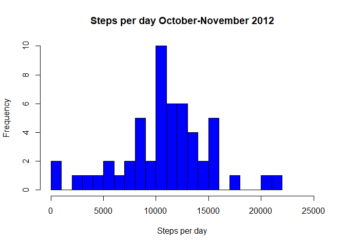
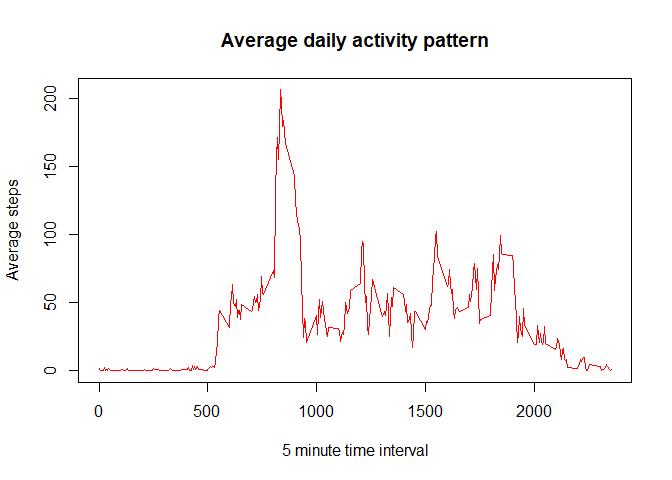
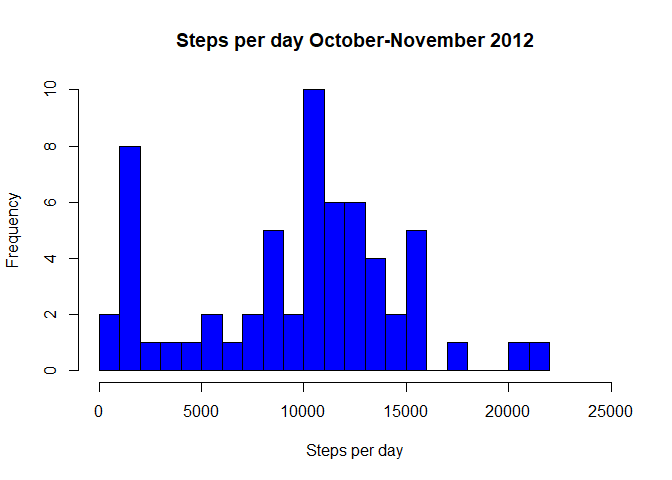
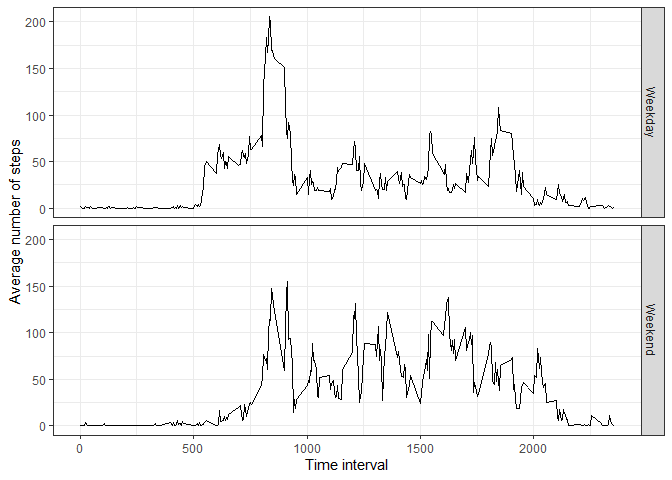

## Loading and preprocessing the data 

```r
#packages 
library(dplyr)
```

```
## 
## Attaching package: 'dplyr'
```

```
## The following objects are masked from 'package:stats':
## 
##     filter, lag
```

```
## The following objects are masked from 'package:base':
## 
##     intersect, setdiff, setequal, union
```

```r
library(ggplot2)

#load the data 
unzip(zipfile = 'activity.zip')
orig_data <- read.csv('activity.csv')

#convert character dates into date
orig_data$date <- as.Date(orig_data$date, "%Y-%m-%d")
```

## What is mean total number of steps taken per day
Histogram of steps per day

```r
#calculate mean steps per day 
stepsperday <- orig_data %>%
    group_by(date) %>%
    summarize(totsteps = sum(steps))

#make histogram
hist(stepsperday$totsteps, breaks = 16, col = 'blue', xlab = 'Steps per day', 
     main = 'Steps per day October-November 2012', xlim = c(0, 25000), 
     ylim = c(0, 10))
```

<!-- -->

Mean steps per day

```r
mean(stepsperday$totsteps, na.rm = T)
```

```
## [1] 10766.19
```

Median steps per day

```r
median(stepsperday$totsteps, na.rm = T)
```

```
## [1] 10765
```

## What is the average daily activity pattern
Time series plot of average daily activity

```r
pattern <- orig_data %>%
    group_by(interval) %>%
    summarize(av_steps = mean(steps, na.rm = T))

plot(x = pattern$interval, y = pattern$av_steps, type = 'l', 
     xlab = '5 minute time interval', ylab = 'Average steps', 
     main = 'Average daily activity pattern', col = 'red') 
```

<!-- -->

Maximum number of steps occurs during this interval: 

```r
pattern[which.max(pattern$av_steps),]
```

```
## # A tibble: 1 x 2
##   interval av_steps
##      <int>    <dbl>
## 1      835     206.
```

## Imputing missing values 
Total number of missing values for steps 

```r
count(orig_data[is.na(orig_data$steps), ])
```

```
##      n
## 1 2304
```

Filling in missing values using median value for that interval 

```r
med_int <- orig_data %>%
    group_by(interval) %>%
    summarize(med_steps = median(steps, na.rm = T))

nomiss <- orig_data
nomiss$steps[is.na(nomiss$steps)] <- 
    med_int$med_steps[match(nomiss$interval,
                            med_int$interval)][which(is.na(nomiss$steps))]
```

Histogram of total number of steps taken each day 

```r
#calculate mean steps per day 
stepsperday <- nomiss %>%
    group_by(date) %>%
    summarize(totsteps = sum(steps))

#make histogram
hist(stepsperday$totsteps, breaks = 16, col = 'blue', xlab = 'Steps per day', 
     main = 'Steps per day October-November 2012', xlim = c(0, 25000), 
     ylim = c(0, 10))
```

<!-- -->

Imputing the missing data changed the histogram of steps per day quite a bit, 
with a new peak around 2000 steps per day 

Mean steps per day

```r
mean(stepsperday$totsteps, na.rm = T)
```

```
## [1] 9503.869
```

Median steps per day

```r
median(stepsperday$totsteps, na.rm = T)
```

```
## [1] 10395
```

Imputing the data reduced our mean number of steps per day and reduced the
total daily steps 

## Are there differences in activity patterns between weekdays and weekends? 
Panel plot separated by weekdays and weekends 

```r
#create new variable for weekday vs weekend 
nomiss$weekday <- as.factor(weekdays(nomiss$date))
nomiss$flag_weekday <- 
    as.factor(ifelse(nomiss$weekday %in% c('Saturday', 'Sunday'), 'Weekend', 
                     'Weekday'))

week_av <- nomiss %>%
    group_by(flag_weekday, interval) %>%
    summarize(av_steps = mean(steps))
```

```
## `summarise()` has grouped output by 'flag_weekday'. You can override using the `.groups` argument.
```

```r
#create panel plot 
ggplot(week_av, aes(x = interval, y = av_steps)) +
    geom_line() +
    facet_grid(flag_weekday ~ .) +
    xlab('Time interval') +
    ylab('Average number of steps') + 
    theme_bw()
```

<!-- -->

This person has more steps in the morning of weekdays, but has more steps 
during other time intervals on the weekends 
